v2ray订阅地址使用说明 v2rayN版 windows端

V2rayN 图文教程
===================

获取软件
打开页面 https://github.com/2dust/v2rayN/releases 下载最新版软件 如图
或者直接点击 https://github.com/2dust/v2rayN/releases/download/3.5/v2rayN-Core.zip 下载 3.5版本
解压缩 后，运行 v2rayN.exe 文件 
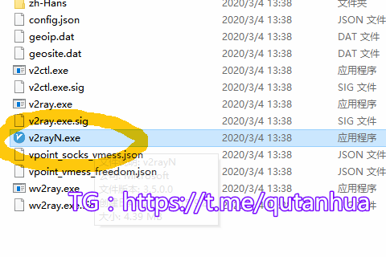</li>
<li>由于v2rayN没有任何签名， 会弹出是否运行此文件，点击 更多信息 
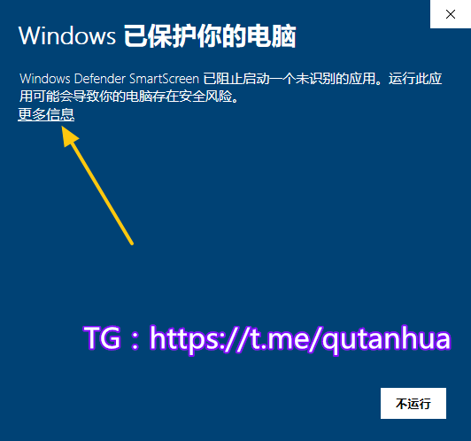</li>
<li>点击仍要运行 
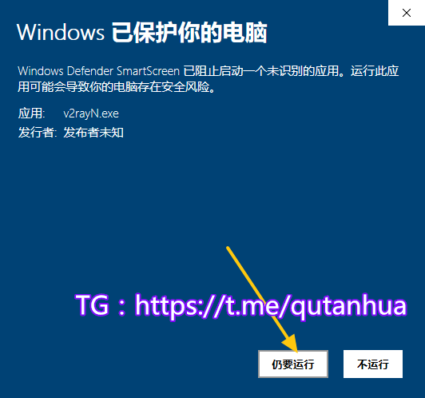</li>
<li>打开软件主界面 
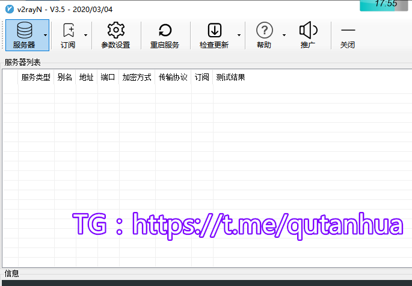</li>
</ul>
<h2 id="用订阅的方式获取节点">用订阅的方式获取节点</h2>
<ul>
<li>软件主界面 订阅 - 订阅设置 
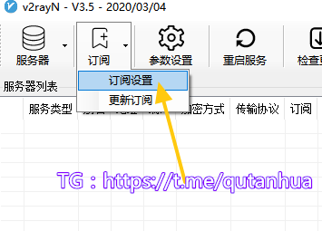</li>
<li>点击添加 
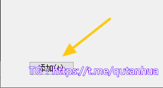</li>
<li>没有v2ray订阅？请移步 👉 https://sesegu.github.io/ivpn 免费获取</li>
<li>在 软件 - 订阅设置 - 地址处粘贴上述 订阅地址 ， 备注可以任意填写 点击确定 
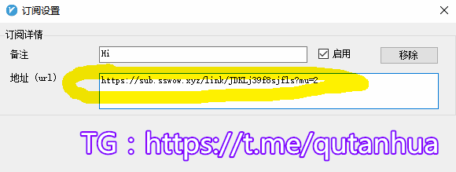</li>
<li>在 软件界面 - 订阅 - 更新订阅 ，来获取节点 
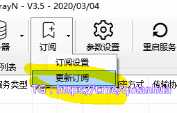</li>
</ul>
<h2 id="通过节点代理上网">通过节点代理上网</h2>
<ul>
<li>

在 软件界面 查看所有的节点

</li>
<li>
<figure data-type="image" tabindex="1">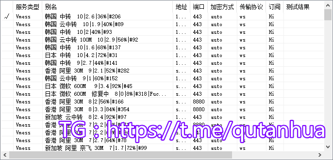</figure>
</li>
<li>

按ctrl+a选择全部节点，然后右键 测试服务器延迟Tcping

</li>
<li>
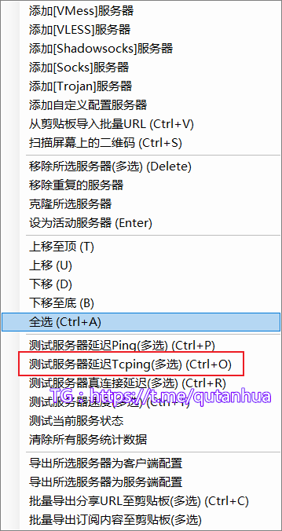
</li>
<li>

选择测试结果数值小的节点 右键点击 设为活动的服务器 
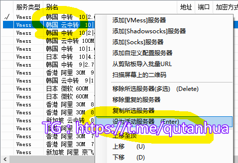

</li>
<li>

右键点击 桌面-任务栏右下角 v2rayN软件图标 - HTTP代理 - 全局代理 
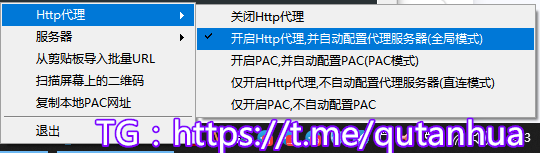

</li>
<li>

然后愉快的上网吧

</li>
<li>

v2rayN简单易上手，适合新手使用，但是不能自动更换节点。节点受到长城墙干扰时，需要手动更换节点，这点比较麻烦。

</li>
